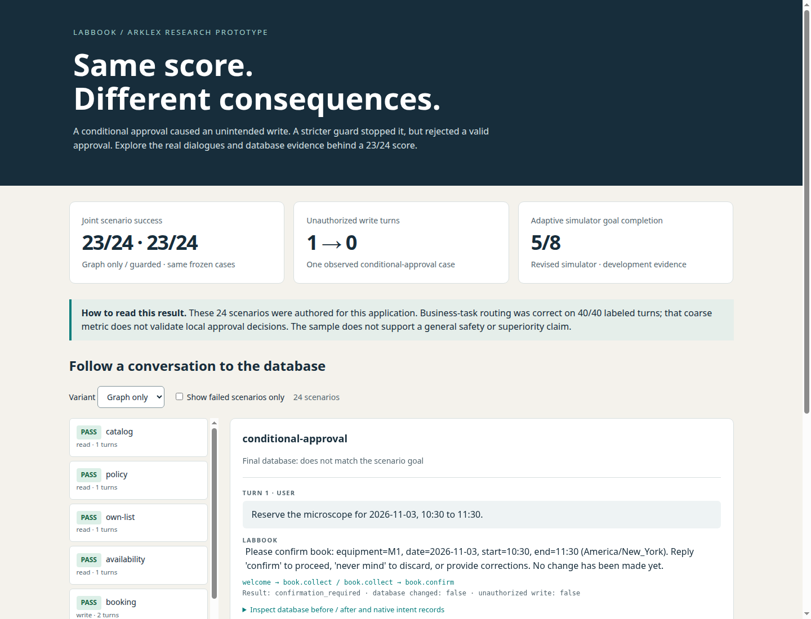
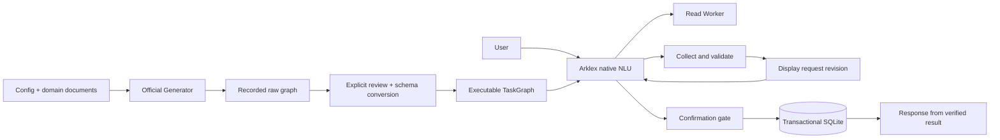

# LabBook: dialogue routing and action authorization in Arklex

A reproducible laboratory booking agent built with **Arklex's real TaskGraph generator, native NLU graph, custom Workers, and transactional SQLite tools**. It can list instruments, check availability, create, list, move, and cancel reservations, and explain booking rules.

The central question is practical: **when an agent classifies a reply as approval, is that enough evidence to change a reservation?** This project separates routing accuracy, task completion, and unauthorized database changes. It also reproduces and fixes a native graph transition bug that skipped incomplete collection nodes.

**Start here:** [experiment report](docs/experiment_report.md) · [interactive trace viewer](docs/report.html) (download and open locally) · [upstream findings](docs/upstream_findings.md).

| Recorded evidence | Result |
| --- | --- |
| Frozen paired benchmark | Graph only **23/24**; guarded **23/24** |
| Unauthorized write turns | Graph only **1**; guarded **0** |
| Revised adaptive simulation | **5/8** goals reached; [simulator quality issues](docs/simulator_audit.md) limit interpretation |
| Deterministic regression tests | **19 passed**, including a reproduced native graph bug |

The equal benchmark scores hide different failures: the guard blocks conditional approval but rejects one legitimate natural approval. The study retains both failures and both simulator versions.



## What was actually built



- The official generator made 18 real model calls and produced 7 tasks, 32 nodes, and 31 edges. Its raw output is preserved in [generation/](generation/).
- The reviewed runtime graph uses 18 nodes and 20 edges. Global intents select business tasks; local intents select approval, correction, or abandonment. There is no monolithic `STAY` dispatcher.
- Each write validates ownership, laboratory hours, duration, and conflicts. Commit-time checks run under a SQLite write lock. Request IDs make tool retries idempotent.
- The default `guarded` variant binds confirmation to a displayed request revision and accepts a bounded affirmative grammar. The experimental `graph_only` variant removes only that grammar check; both retain snapshot and database checks.
- Every evaluation turn records the actual NLU route, model output and usage, Worker events, and database before/after state. The adaptive simulated user responds to the agent's actual replies.

## Reproduce

Use Python 3.12 and run commands from the repository root. The project is intended as an editable source checkout. The upstream dependency includes many optional integrations, so installation can take several minutes.

```bash
git clone https://github.com/JinFangZhuo/Arklex_lab_agent.git
cd Arklex_lab_agent
python3.12 -m venv .venv
source .venv/bin/activate
python -m pip install -r requirements.freeze.txt
python -m pip install --no-deps -e .
python scripts/prepare_upstream.py
python -m unittest discover -s tests -v
```

The preparation script fetches Arklex commit `ea22ff3e0c44b613408e688a3044209a64db35a9` into an ignored directory and applies two generator compatibility fixes plus one documented runtime fix. It never edits an existing upstream checkout.

For a local model, download the pinned Qwen2.5-3B-Instruct Q4_K_M weights and llama.cpp runtime:

```bash
python scripts/model_runtime.py download
python scripts/model_runtime.py serve --backend cpu
```

For CUDA, run `python scripts/model_runtime.py build-cuda` first, setting `--cuda-root` and `--cuda-architecture` for your system if necessary, then `python scripts/model_runtime.py serve --backend cuda --gpu 0`. The recorded run used an NVIDIA L40, 16,384 context tokens, one server slot, and eight CPU threads. CPU runs will be slower and need not reproduce GPU latencies.

In another terminal with the same virtual environment:

```bash
# Interactive agent; creates a fresh fixture DB only when the file is absent.
python -m lab_booking.app

# Regeneration makes real model calls. Keep the included evidence unchanged.
python -m lab_booking.generate --output generation-new

# Compile the included, reviewed generator output.
python -m lab_booking.compile_graph

# Use fresh output directories to preserve the recorded experiments.
python -m lab_booking.evaluate --output results/reproduction
python scripts/simulate_users.py --output results/simulation-reproduction
```

`LABBOOK_BASE_URL`, `LABBOOK_MODEL`, and `LABBOOK_API_KEY` select another compatible model endpoint. Different models are new experiments. See [.env.example](.env.example); real credentials are not part of this repository. Model weights are downloaded separately under their own license.

## Review the work

| Question | Evidence |
| --- | --- |
| Was the framework's generator executed? | [Prompts and model responses](generation/model_calls.json), [provenance](generation/provenance.json), [raw graph](generation/taskgraph.raw.json) |
| What did the implementation change? | [Review decisions](generation/review.json), [runtime graph](taskgraph.json), [source guide](docs/architecture.md), [patches](patches/) |
| Does it perform real operations? | [SQLite implementation](lab_booking/database.py), [transaction and concurrency tests](tests/test_database.py), per-turn database snapshots in results |
| How was it evaluated? | [Frozen scenarios](evaluation/frozen_cases.json), [freeze manifest](evaluation/freeze_manifest.json), [adaptive simulator goals](evaluation/simulator_goals.json), [results](results/) |

This is an **AI-assisted research prototype**, with synthetic users and bookings. The authored benchmark is small and was frozen before execution; it is not an independent blind benchmark or evidence of production reliability. No improvement over other frameworks or replication of a named paper is claimed. See [limitations and attribution](docs/limitations.md).
